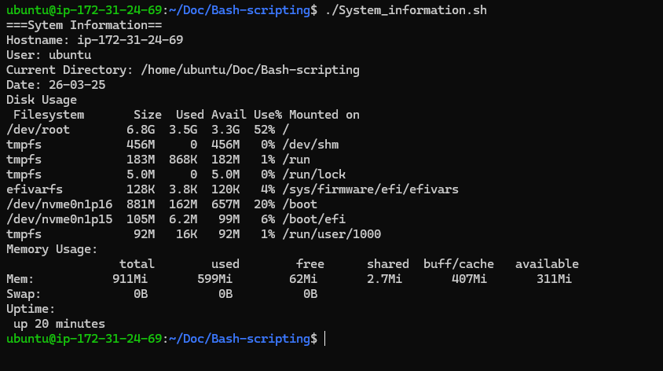
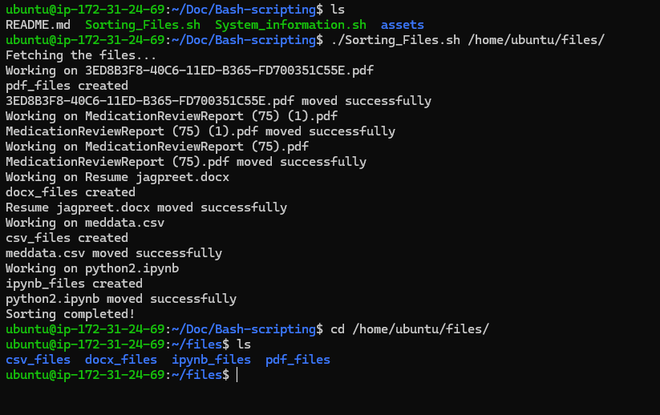

# 🐚 Bash Scripts Collection

A collection of useful Bash scripts created for learning and automation.  
This repository currently includes:

- 📊 System Information Script  
- 📂 File Sorting Script (by extension)

---

## 📊 1. System Information Script

### 📌 Description
This script displays useful system information such as:
- Hostname
- Current user
- Uptime
- Disk usage
- Memory usage
- CPU information

### ▶️ How to Run
chmod +x system_info.sh
./system_info.sh

### 🖥️ Example Output

---

## 📂 2. File Sorting Script

### 📌 Description
This script organizes files in a directory by their extensions.  

Examples:
- .txt → txt_files/
- .jpg → jpg_files/
- .pdf → pdf_files/

### ▶️ How to Run
chmod +x sort_files.sh
./sort_files.sh /path/to/directory

### ⚙️ How It Works
- Takes a directory as input
- Loops through files
- Detects file extensions
- Creates folders if not present
- Moves files into respective folders

### 🖥️ Example Output

---

