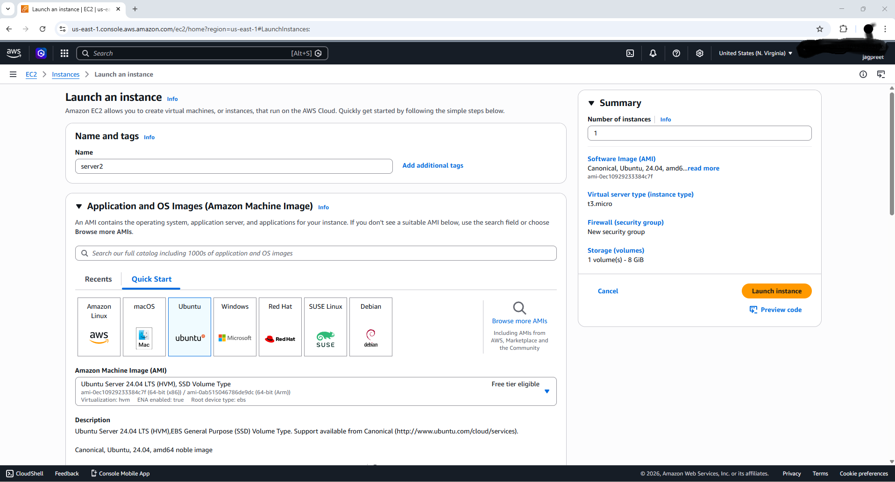
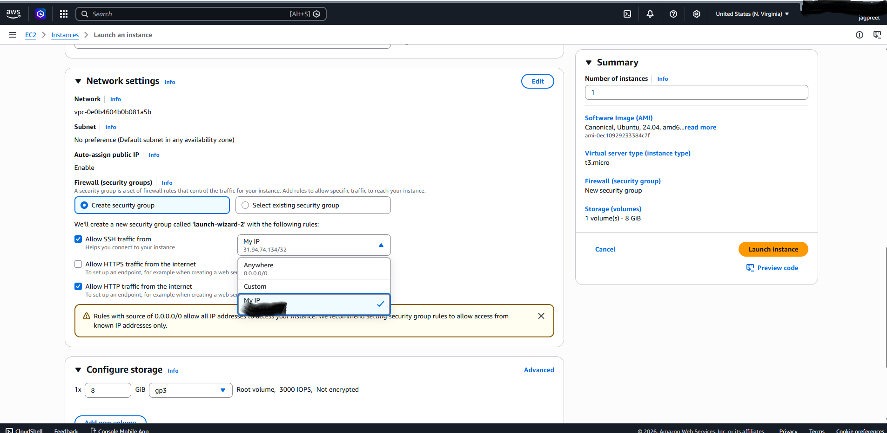

# EC2 Instance Creation Guide 🚀

This guide explains how to launch an Ubuntu EC2 instance on AWS.

---

## 1. Launch Instance

1. Log in to the **AWS Management Console** → EC2 → **Launch Instance**  
   *(Tip: search “EC2” in the search bar to find it)*

2. Name your server, select the instance type, and either create a new key pair or select an existing one.

3. Select **Ubuntu 22.04 LTS** AMI.

4. Choose **t2.micro** (free tier) or any instance type you need.

5. Click **Next: Configure Instance Details**.

---

## 2. Configure Security Group

1. Create a new security group or select an existing one.

2. Add inbound rules:
   - **SSH**: port 22, source = your IP (for SSH connection)  
   - **HTTP**: port 80, source = anywhere (0.0.0.0/0)

3. Configure storage if needed.

4. Review and launch.

