# Issues Faced During Deployment

This document records the main problems I encountered while deploying the Django application and the actions I took to resolve them. It is intended to show the practical troubleshooting side of the project, not just the final working setup.

## 1. Nginx Was Not Reachable in the Browser

### Problem

The server appeared healthy:

- Nginx was running
- the expected ports were open
- network rules looked correct

Even so, the application was not loading in the browser.

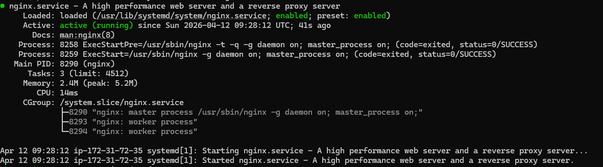
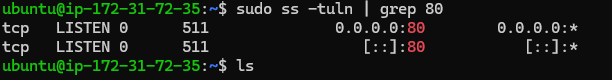

### Cause

The browser was attempting to access the site over `https://`, while the server was only configured for `http://` at that stage.

### Resolution

I tested the URL explicitly with `http://` and confirmed the application was reachable. This helped isolate the issue to protocol mismatch rather than Nginx service health or AWS networking.

## 2. Unable to Clone the Repository

### Problem

The repository clone failed during setup.

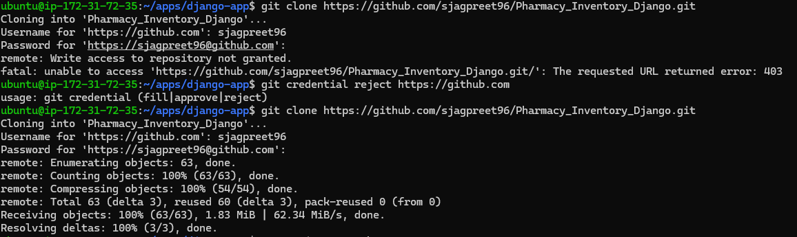

### Cause

The personal access token was created without the required repository read permission.

### Resolution

I generated a new token with the correct read access and retried the clone successfully.

## 3. `requirements.txt` Installation Failed

### Problem

Installing Python dependencies failed on the EC2 instance.

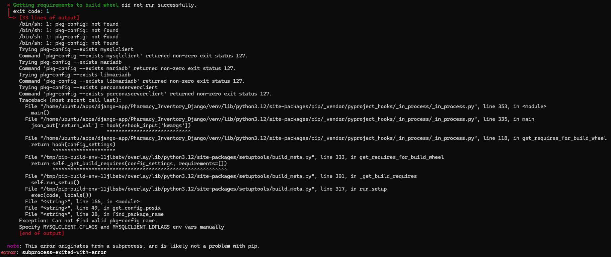

### Cause

Some Python packages required system-level build and development dependencies that were not installed on the server.

### Resolution

I installed the missing packages:

```bash
sudo apt install python3-dev default-libmysqlclient-dev build-essential pkg-config -y
```

After that, the Python dependency installation completed successfully.

## 4. Database Tables Were Missing After Migration

### Problem

The application still reported missing tables even after running migrations.

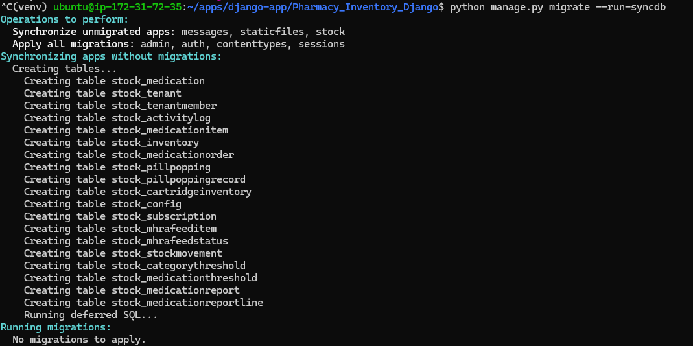

### Cause

The database schema was not fully created for all required tables.

### Resolution

I ran:

```bash
python manage.py migrate --run-syncdb
```

This created the missing tables and resolved the issue.

## 5. Nginx Was Not Listening on Port 80

### Problem

After updating the site configuration in `sites-available`, Nginx was still not serving traffic on port `80`.

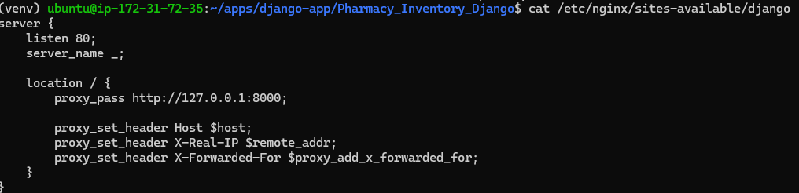

### Cause

The site configuration had been updated, but it was not enabled in `sites-enabled`.

### Resolution

I created the symbolic link:

```bash
sudo ln -s /etc/nginx/sites-available/django /etc/nginx/sites-enabled/
```

Once the site was enabled properly, Nginx started serving the application as expected.

## 6. S3 File Uploads Were Not Saving Through Django

### Problem

The S3 bucket was reachable from the EC2 instance, and I could copy files using Bash and AWS access through the instance role, but uploads from the Django application were not being saved to S3.

### Cause

The issue was caused by using an older Django storage configuration style. In Django 5, the storage configuration syntax changed, and the old approach I was using did not work correctly for the application's file handling.

### Resolution

I updated the project to use the Django 5-compatible `STORAGES` configuration for S3-backed media storage. After correcting the storage settings, Django was able to save files to S3 successfully.

## 7. Jenkins GitHub SSH Error on EC2

### Problem

While configuring Jenkins on EC2 to clone code from GitHub, the pipeline failed with SSH-related errors such as:

- `Permission denied (publickey)`
- `error in libcrypto`


### Cause

This issue had two parts:

- the SSH key had originally been generated for a different user
- Jenkins runs as the `jenkins` user, so it could not use the same key automatically
- the private key stored in Jenkins credentials was copied incorrectly, which caused the `libcrypto` error

### Resolution

I verified SSH access manually first:

```bash
ssh -i ~/.ssh/id_ed25519 -T git@github.com
```

Then I recreated the Jenkins SSH credential correctly:

- used `git` as the username
- added the full private key, including the `BEGIN` and `END` lines

Once the credential was corrected, Jenkins was able to authenticate with GitHub successfully.

## 8. Jenkins Could Not Write the `.env` File During Build

### Problem

During the deployment stage, Jenkins could not write the `.env` file into the application directory because of a permission error.

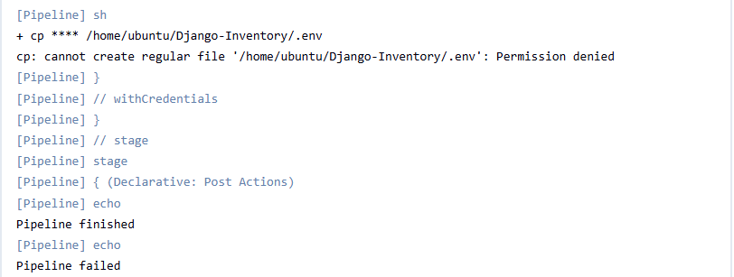

### Cause

The target location did not have the required write permissions for the Jenkins deployment process.

### Resolution

I checked the file permissions first:

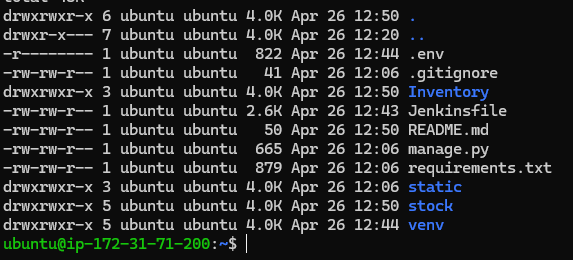

Then I updated the permissions to allow the required access:

```bash
sudo chmod 760 .env
```

After fixing the permissions, Jenkins was able to place the environment file correctly during deployment.

## 9. GitHub Webhook Was Not Triggering Jenkins Properly

### Problem

The GitHub webhook was not triggering the Jenkins pipeline as expected.

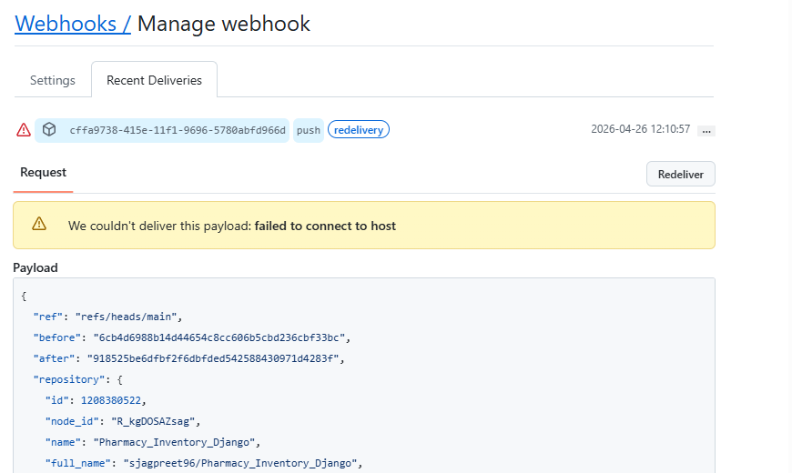

### Cause

The webhook configuration included a typo, which prevented the expected trigger flow from working correctly.

### Resolution

I corrected the webhook configuration in GitHub, after which Jenkins was triggered successfully by repository events.

## 10. Jenkins Could Not Verify GitHub Host Key

### Problem

During pipeline runs, Jenkins could not read the repository and reported that no `ed25519` host key was known for GitHub.


### Cause

GitHub's host key was not available in the known hosts configuration used by Jenkins, so host verification failed.

### Resolution

I added GitHub to the known hosts configuration and updated Jenkins security settings to accept the first connection for Git host key verification.

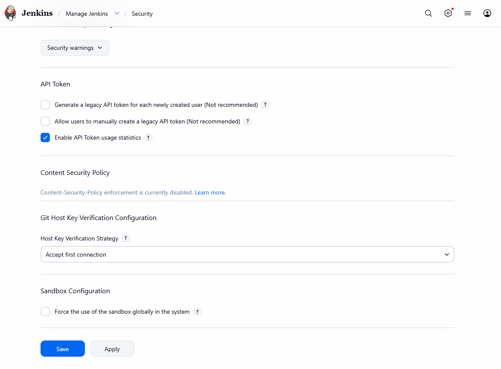

After that, Jenkins was able to verify the host and access the repository correctly.

## 11. Jenkins Could Not Find the `.env` Credential

### Problem

The build failed because Jenkins could not find the credential used to provide the `.env` file.

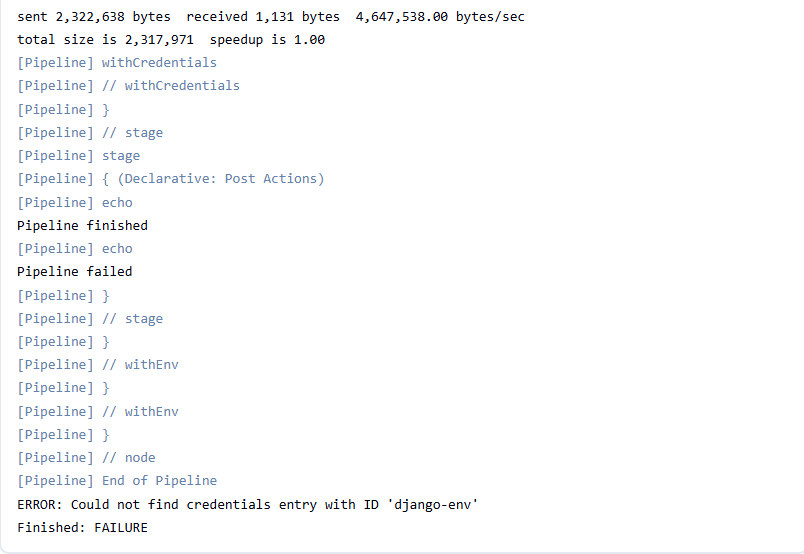

### Cause

The credential ID referenced in the `Jenkinsfile` did not match the actual credential ID in Jenkins. The mismatch was caused by a case-sensitive naming issue or typo.

### Resolution

I checked the credential ID in Jenkins and updated the `Jenkinsfile` reference so the names matched exactly. Once the ID was corrected, Jenkins was able to load the `.env` credential successfully.

## 12. RDS Connection Error During Migration

### Problem

During the migration step in the pipeline, the application could not connect to AWS RDS.

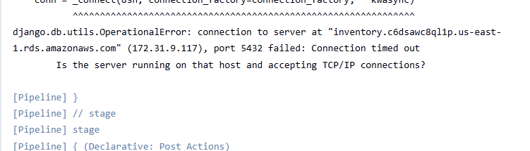

### Cause

The RDS instance was not reachable from the EC2 environment being used for the deployment flow.

### Resolution

I updated the setup so the RDS instance was connected correctly to the EC2 environment used by the application.

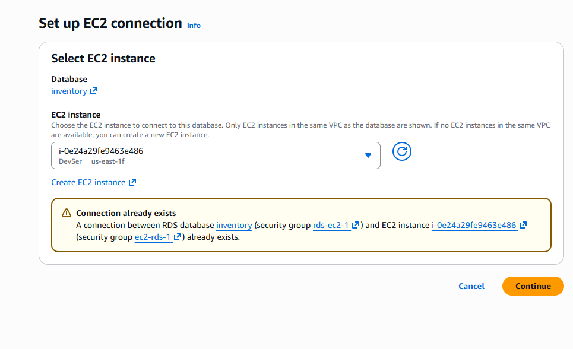

After that, the migration step was able to connect and run successfully.

## 13. Jenkinsfile Syntax Errors

### Problem

Some pipeline runs failed because of syntax mistakes in the `Jenkinsfile`.

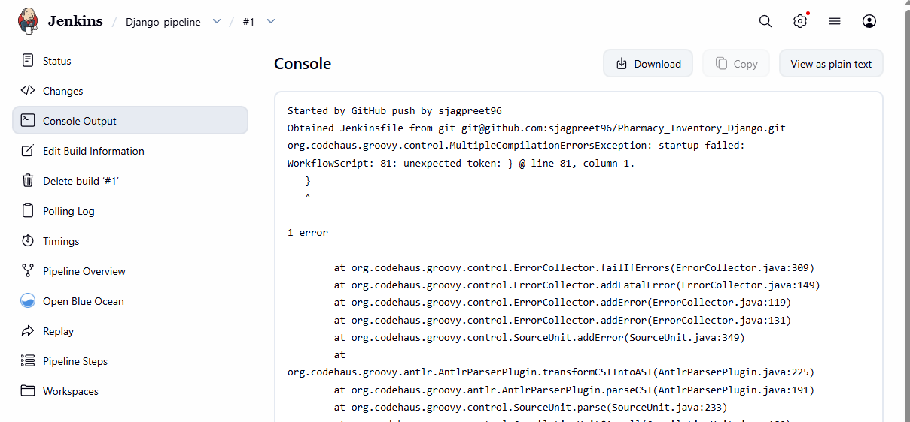

### Cause

The pipeline definition contained syntax issues, which prevented Jenkins from parsing and running the job correctly.

### Resolution

I reviewed and corrected the syntax in the `Jenkinsfile` until the pipeline parsed and executed successfully.

## 14. Python Virtual Environment Support Was Missing on EC2

### Problem

The build failed because Python virtual environment support was not available on the EC2 instance.

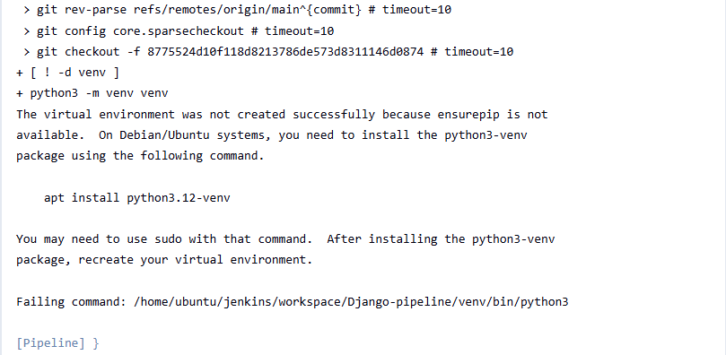

### Cause

The required system package for creating Python virtual environments was not installed on the server.

### Resolution

I installed the missing package required for `venv`, then reran the build. After that, the pipeline was able to create and use the virtual environment successfully.

## 15. Multiple Failed Builds Before Stable Pipeline Success

### Problem

The CI/CD setup did not work on the first attempt. Several builds failed in sequence before the pipeline became stable.

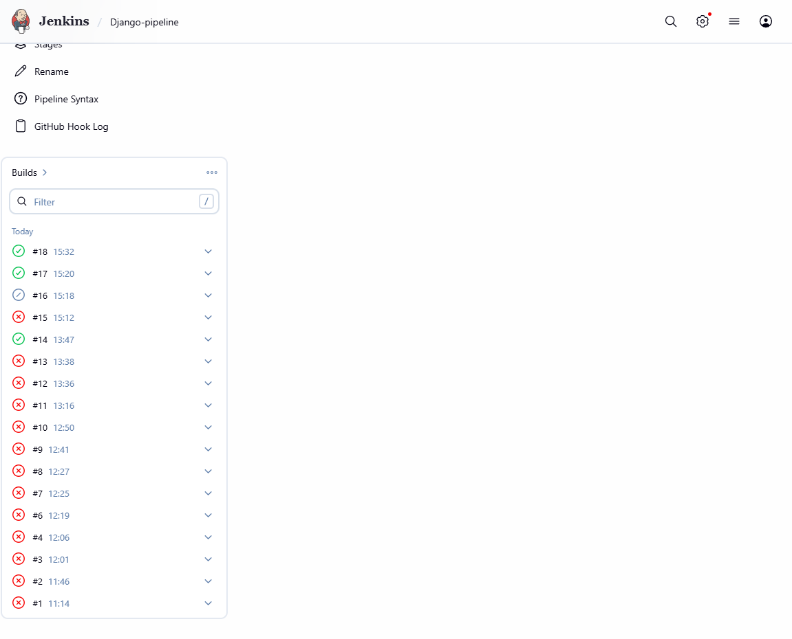

### Cause

The failures were caused by a combination of issues across webhook configuration, SSH setup, credentials, permissions, package availability, database connectivity, and Jenkinsfile syntax.

### Resolution

I debugged each failure one by one and used the Jenkins build history to isolate the next problem in the chain. By around the 18th build, after roughly the first 12 builds had failed continuously, the pipeline reached stable successful deployments.

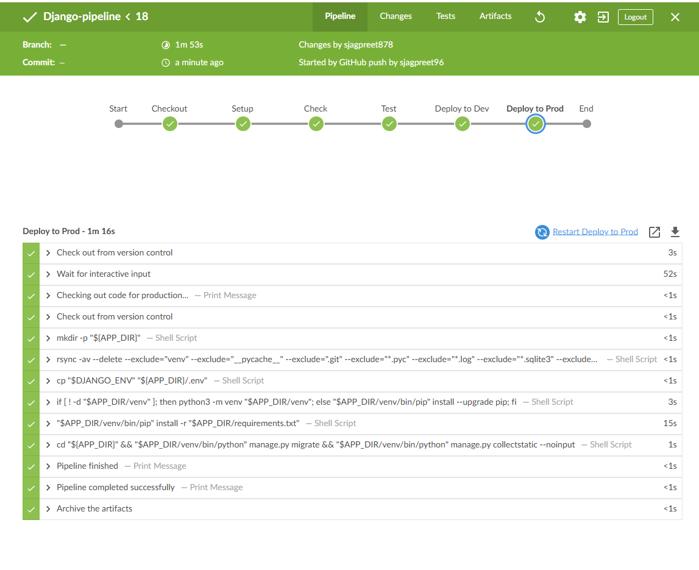

This was an important part of the learning process because it showed how CI/CD pipelines are often built through repeated troubleshooting rather than working perfectly on the first run.

