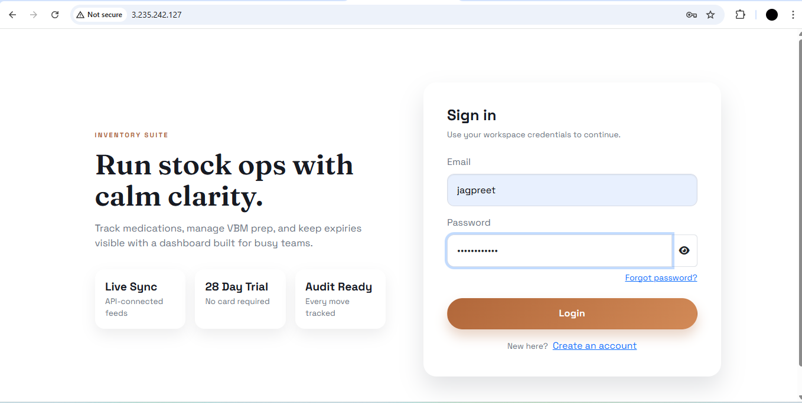
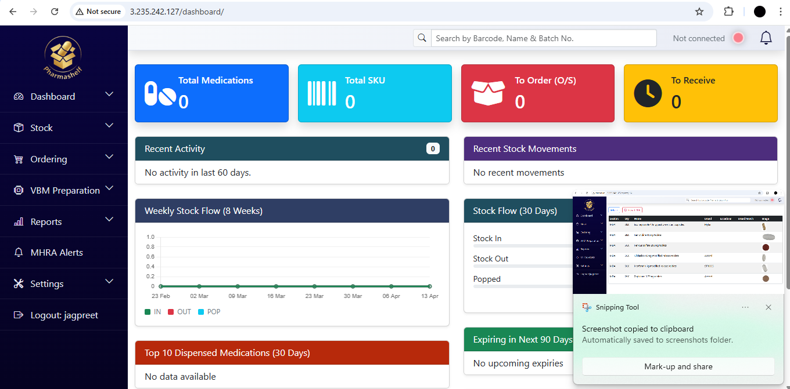
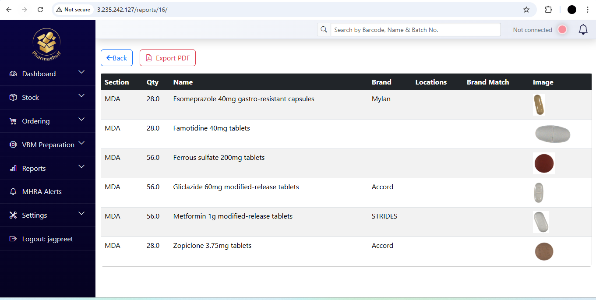
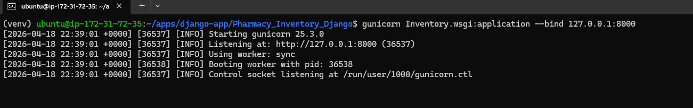
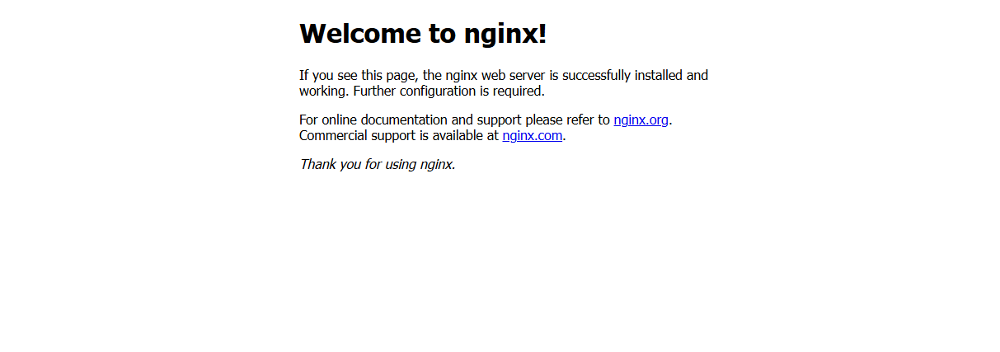

# Django SaaS Deployment on AWS

This project documents my first end-to-end DevOps deployment for a Django multi-tenant application. The objective was to deploy the application in a production-style environment, connect it to managed AWS services, configure a reverse proxy, and document the issues encountered along the way.

It is part of my public DevOps learning portfolio and is written to demonstrate both technical implementation and problem-solving.

## Project Goals

This project was built to practice:

- deploying a Django application on Linux
- configuring Nginx as a reverse proxy
- connecting Django to AWS RDS
- storing static and media files in AWS S3
- documenting deployment issues and fixes clearly
- preparing for CI/CD with Jenkins as the next phase

## Architecture

Current deployment flow:

```text
User -> Nginx -> Gunicorn -> Django application
                            |
                            +-> AWS RDS (database)
                            +-> AWS S3 (static and media files)
```

Planned CI/CD extension:

```text
GitHub -> Jenkins on separate EC2 -> deploy/update Django app EC2
```

## Stack

- `Django` for the application
- `Gunicorn` as the application server
- `Nginx` as the reverse proxy
- `AWS EC2` for application hosting
- `AWS RDS` for the managed relational database
- `AWS S3` for static and media storage
- `Ubuntu` as the server operating system
- `GitHub` for version control
- `Jenkins` planned for CI/CD automation

## What This Project Covers

This project includes:

- deploying a Django application on an EC2 instance
- configuring Nginx to serve as the public entry point
- connecting the application to an RDS database
- integrating S3 for file storage
- organizing deployment-related scripts and configuration files
- documenting real deployment problems and their solutions

## Repository Structure

- `nginx/` - Nginx configuration files used for the deployment
- `scripts/` - helper scripts for setup or deployment tasks
- `jenkins/` - Jenkins-related work for the upcoming CI/CD stage
- `screenshots/` - deployment and application screenshots used in documentation
- `.env.example` - example environment variables for a safe public configuration
- `Issues_faced/README.md` - troubleshooting notes from the project

## Screenshots

The following screenshots capture parts of the deployment and application setup:

### Application





### Deployment and Troubleshooting





## Key Learning Outcomes

Through this project, I gained practical experience with:

- Linux-based application deployment
- reverse proxy configuration and web traffic flow
- AWS networking and service integration
- externalizing storage and database dependencies
- debugging deployment and environment issues
- writing technical documentation that explains both process and outcomes

## Challenges Encountered

Some of the issues I ran into during this project included:

- browser requests opening with HTTPS when the server was configured only for HTTP
- repository clone failures caused by incorrect token permissions
- dependency installation failures caused by missing system packages
- missing database tables after migrations
- Nginx configuration changes not taking effect because the site was not enabled correctly

Detailed notes are available here:

- [`Issues_faced/README.md`](./Issues_faced/README.md)

## Security and Good Practices

While working on this deployment, I focused on basic operational discipline:

- avoiding hardcoded secrets in the repository
- using environment variables for sensitive settings
- managing access through AWS security groups and permissions
- separating infrastructure responsibilities across services

The shared version of `settings.py` is now sanitized for public use and expects sensitive values such as the Django secret key, database credentials, AWS configuration, and third-party API keys to be provided through environment variables.

## Next Phase

The next step is to implement Jenkins-based CI/CD with Jenkins running on a separate EC2 instance from the Django application server. This will make the project closer to a realistic multi-server deployment workflow and strengthen the automation side of the case study.

## Purpose of This Project

This project is intended to show how I approach learning DevOps: by building, troubleshooting, documenting, and improving real deployments in public.
