# Django SaaS Application Deployment and CI/CD Pipeline on AWS

This project is an end-to-end DevOps case study for a Django multi-tenant application that I developed and deployed on AWS. It covers the full progression from manual application deployment to Jenkins-based CI/CD automation, including reverse proxy setup, managed database and storage integration, and staged releases across development and production environments.

It is part of my public DevOps learning portfolio and is written to demonstrate both technical implementation and problem-solving.

## Project Goals

This project was built to practice:

- deploying a Django application on Linux
- configuring Nginx as a reverse proxy
- connecting Django to AWS RDS
- storing static and media files in AWS S3
- documenting deployment issues and fixes clearly
- building CI/CD automation with Jenkins across development and production environments

## Architecture

Overall project architecture:

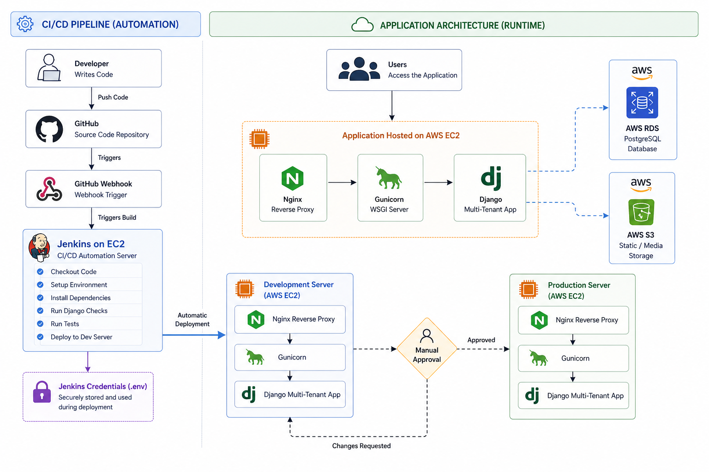

Phase 1 deployment flow:

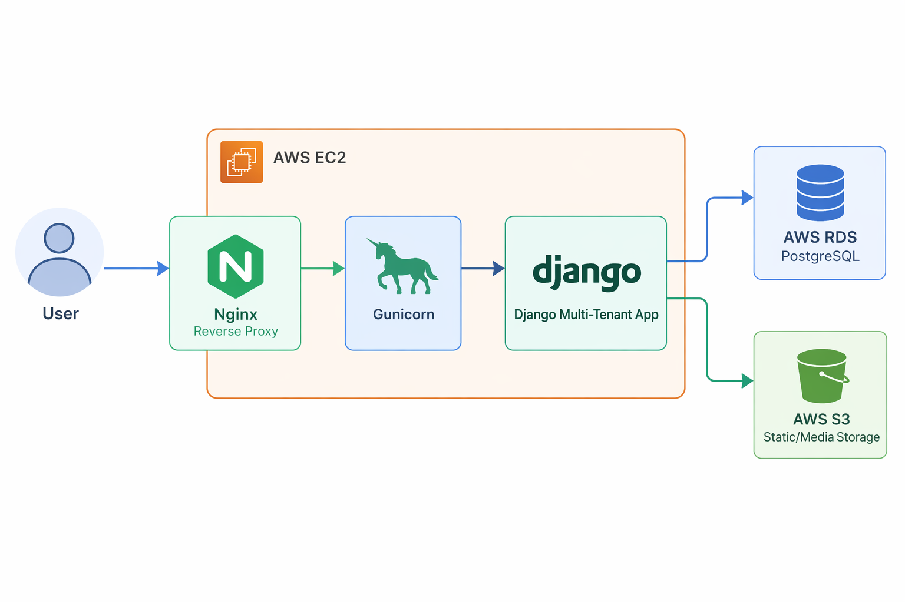

Phase 2 CI/CD flow:

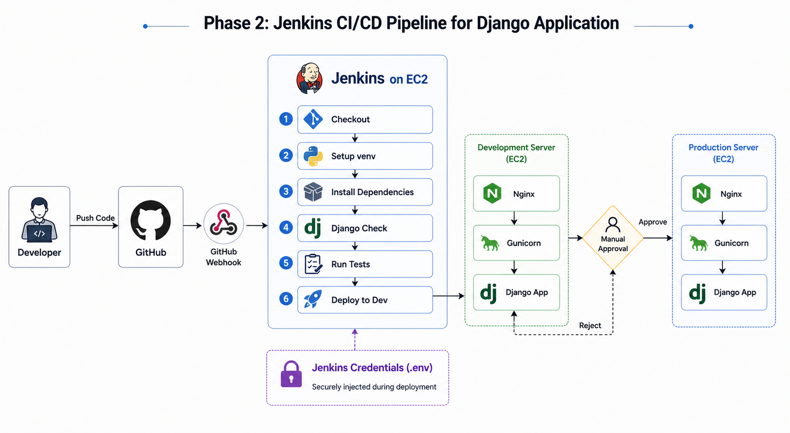

## Stack

- `Django` for the application
- `Gunicorn` as the application server
- `Nginx` as the reverse proxy
- `AWS EC2` for application hosting
- `AWS RDS` for the managed relational database
- `AWS S3` for static and media storage
- `Ubuntu` as the server operating system
- `GitHub` for version control
- `Jenkins` for CI/CD automation
- `Jenkins agents` for environment-specific deployment execution

## What This Project Covers

This project includes:

- deploying a Django application on an EC2 instance
- configuring Nginx to serve as the public entry point
- connecting the application to an RDS database
- integrating S3 for file storage
- automating deployment with a Jenkins pipeline triggered by GitHub webhook
- using Jenkins agents to run deployment stages on the correct servers
- deploying automatically to a development server and promoting to production after approval
- organizing deployment-related scripts and configuration files
- documenting real deployment problems and their solutions

## Project Phases

### Phase 1: Application Deployment

Phase 1 focuses on building and deploying the application in a production-style environment. This stage includes:

- deploying the Django application on EC2
- configuring Gunicorn and Nginx
- connecting the application to AWS RDS
- storing static and media files in AWS S3

### Phase 2: Jenkins CI/CD

Phase 2 adds CI/CD automation with Jenkins. This stage includes:

- triggering builds through a GitHub webhook
- using Jenkins agents to target the correct deployment environment
- checking out code and preparing the virtual environment
- running Django checks and application tests
- automatically deploying to the development server
- pausing for manual approval before production deployment
- deploying to the production server after approval

## Repository Structure

- `nginx/` - Nginx configuration files used for the deployment
- `scripts/` - helper scripts for setup or deployment tasks
- `jenkins/` - Jenkins pipeline configuration, including the deployment workflow
- `screenshots/` - deployment and application screenshots used in documentation
- `settings.py` - Django configuration showing the deployment setup
- `Issues_faced/README.md` - troubleshooting notes from the project

## Key Files

- `jenkins/Jenkinsfile` - pipeline definition for validation and staged deployment
- `nginx/nginx.conf` - reverse proxy configuration for serving the Django application
- `settings.py` - Django configuration adapted for AWS services and environment-based secrets

## Screenshots

The following screenshots capture parts of the deployment and application setup:

### Application

### Deployment Evidence

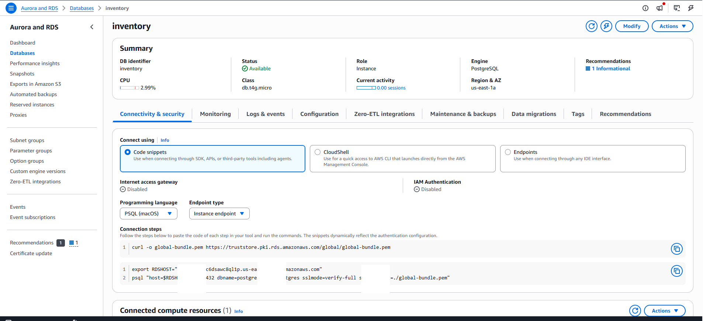
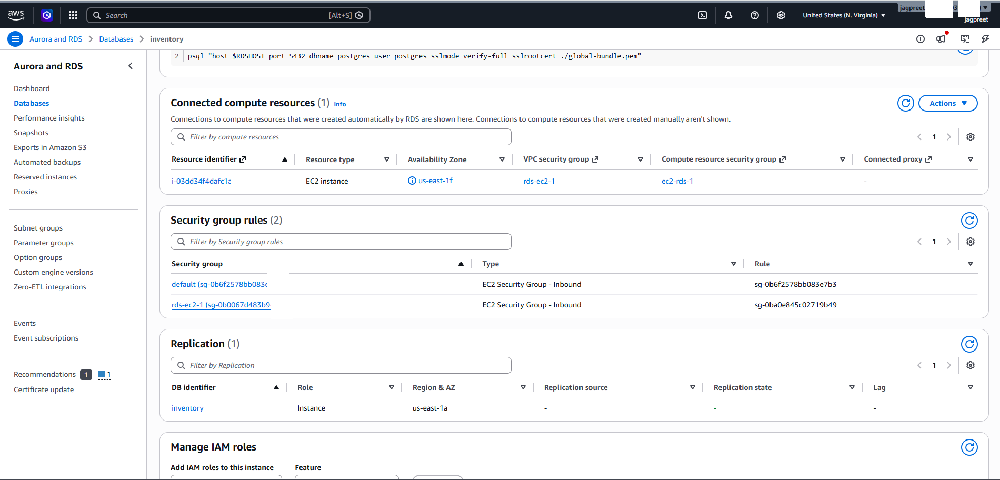
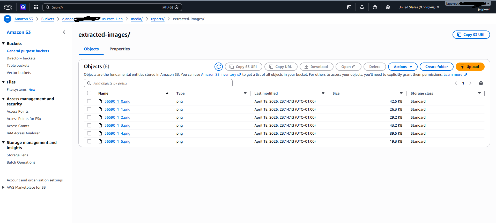

### CI/CD Evidence

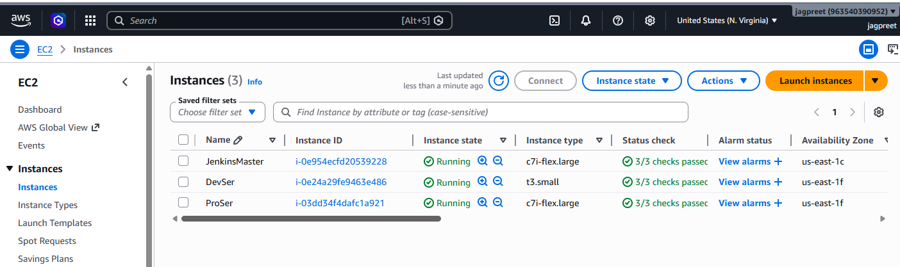
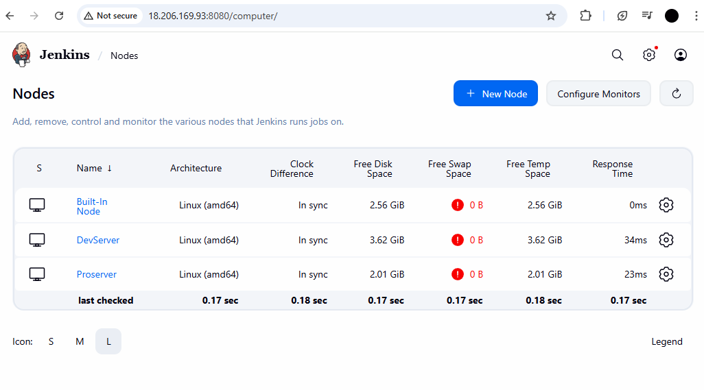
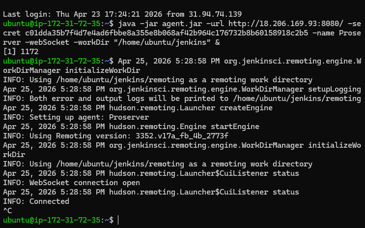
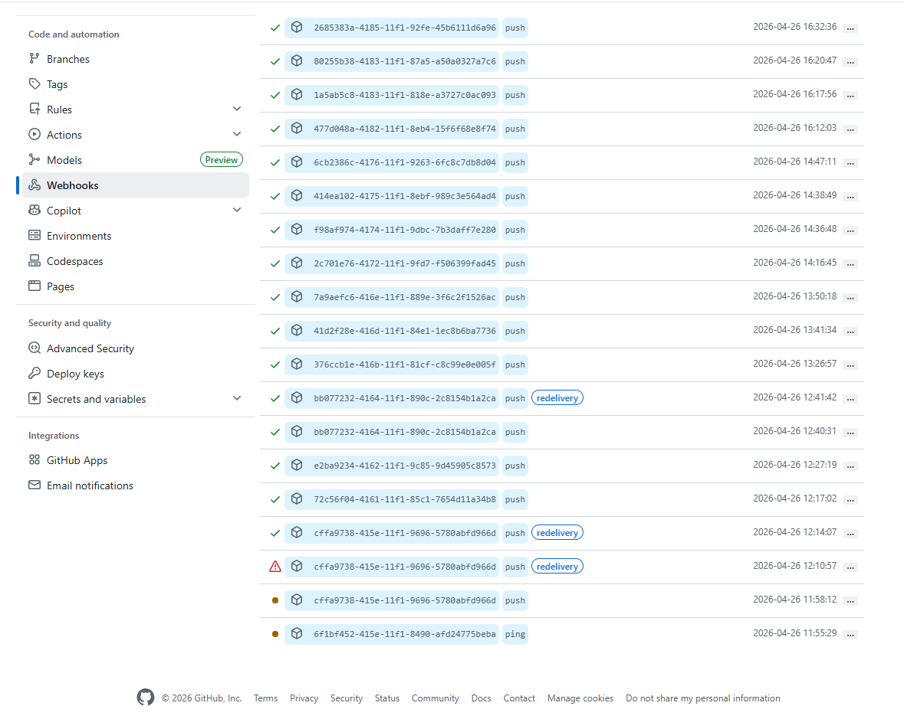

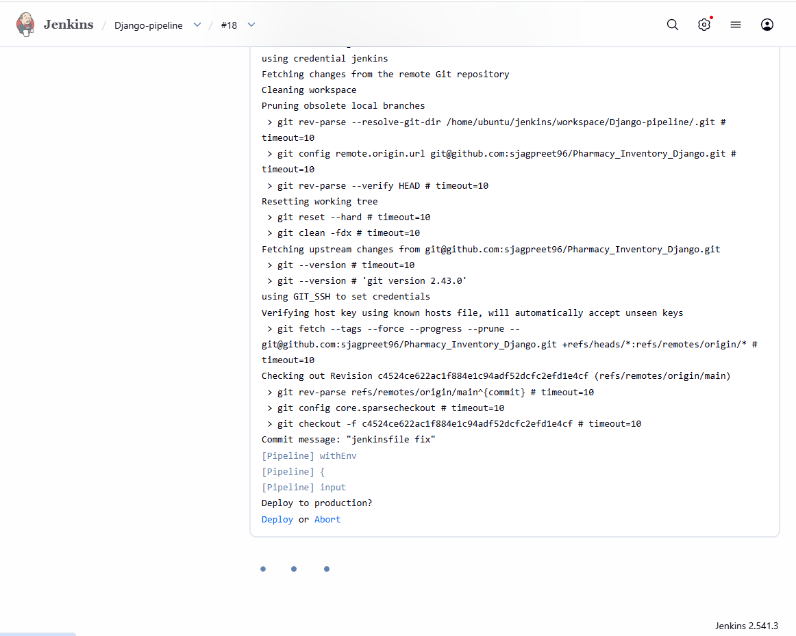

## Key Learning Outcomes

Through this project, I gained practical experience with:

- Linux-based application deployment
- reverse proxy configuration and web traffic flow
- AWS networking and service integration
- externalizing storage and database dependencies
- CI/CD pipeline design with gated production deployment
- GitHub webhook integration with Jenkins
- using Jenkins agents to separate deployment execution by environment
- debugging deployment and environment issues
- writing technical documentation that explains both process and outcomes

## Challenges Encountered

Some of the issues I ran into during this project included:

- browser requests opening with HTTPS when the server was configured only for HTTP
- repository clone failures caused by incorrect token permissions
- dependency installation failures caused by missing system packages
- Django 5 S3 storage configuration issues caused by using an outdated storage syntax
- missing database tables after migrations
- Nginx configuration changes not taking effect because the site was not enabled correctly
- webhook, Jenkins credential, environment file, and deployment permission issues during CI/CD setup

Detailed notes are available here:

- [`Issues_faced/README.md`](./Issues_faced/README.md)

## Security and Good Practices

While working on this deployment, I focused on basic operational discipline:

- avoiding hardcoded secrets in the repository
- using environment variables for sensitive settings
- passing the application `.env` file through Jenkins credentials during deployment
- managing access through AWS security groups and permissions
- separating infrastructure responsibilities across services

The shared version of `settings.py` expects sensitive values such as the Django secret key, database credentials, AWS configuration, and third-party API keys to be provided through environment variables.

## Next Improvements

The next areas I plan to improve are:

- refining the Jenkins pipeline further
- adding stronger release validation and rollback planning
- extending the project with containerization and infrastructure automation

## Purpose of This Project

This project is intended to show how I approach learning DevOps: by building, troubleshooting, documenting, and improving real deployments in public.
